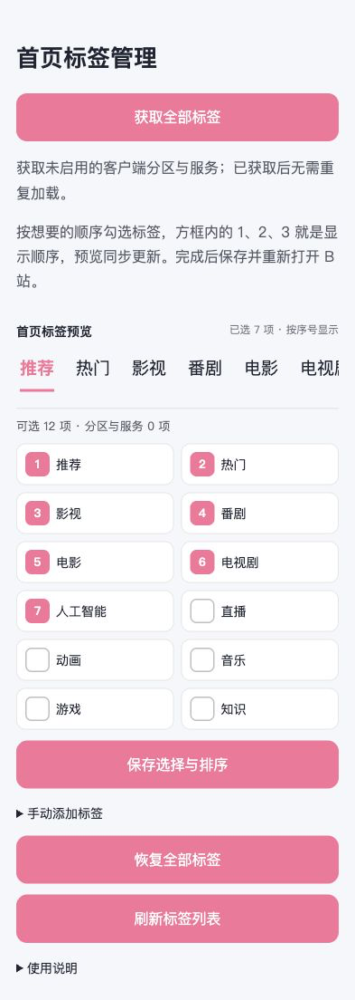
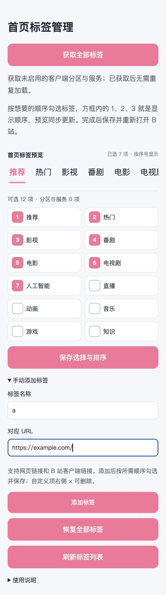
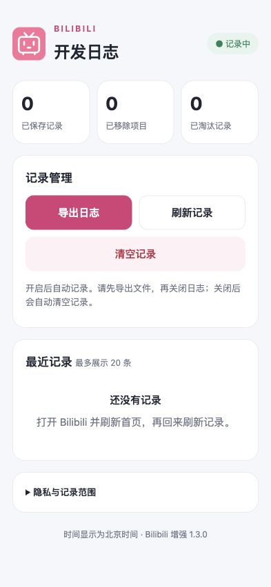
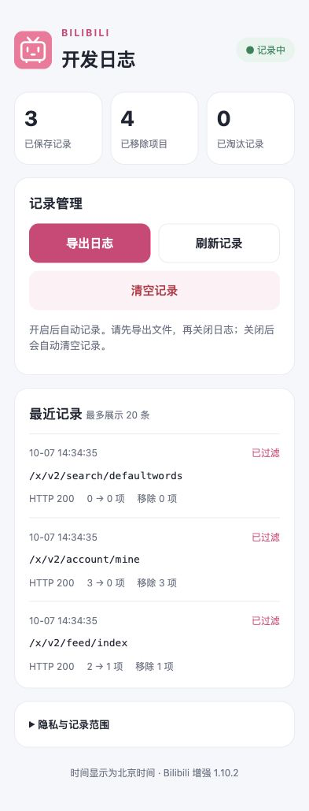
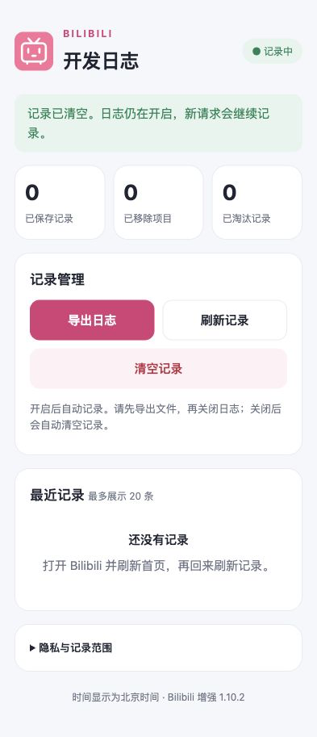

# Bilibili 增强

以 Loon 为主入口的 Bilibili 广告与推荐过滤插件，共享脚本无需下载第三方运行库。其他代理软件可通过支持 Loon 插件的转换工具转换配置；本仓库不提供单独的其他平台版本，转换后的语法、参数传递和脚本兼容性需要在目标软件验证。

## 功能与默认值

广告过滤固定开启，无需设置：包括开屏广告、首页及视频流广告、视频页广告和相关推荐广告。需开启 MitM 并安装和信任 Loon 证书；更新后重新打开 B 站并刷新推荐。已缓存广告和未覆盖接口仍可能显示。

| 设置 | 默认 | 作用 |
| --- | --- | --- |
| 过滤开屏广告 | 默认移除，无开关 | 清空已登记开屏投放和品牌开屏素材列表，包括无广告标记的品牌素材及普通开屏插画；保留其他启动配置 |
| 过滤首页广告 | 默认移除，无开关 | 移除已识别广告卡片；横幅只移除广告项，保留其他内容 |
| 游戏广告曝光上报拦截 | 默认拦截，无开关 | 精确拦截 `impression.biligame.com`；无需 MitM，开屏素材展示仍需结合接口过滤与实机验证 |
| 视频页广告过滤 | 默认移除，无开关 | 移除已识别的播放器下方广告、视频详情广告及相关推荐广告卡片 |
| 播放中三连／关注浮层 | 默认移除，无开关 | 删除已识别的三连契约卡与关注引导，保留手动点赞、投币、收藏和关注 |
| 我的页会员推广过滤 | 默认移除，无开关 | 隐藏“开通会员／续订会员”推广卡片，保留会员身份、权益及其他页面入口 |
| 搜索框默认词清空 | 默认处理，无开关 | 清空已识别默认推荐文字；保留手动输入、历史、联想和正常搜索结果 |
| 首页标签自选、排序、预览与手动添加 | 保留全部 | 本地页面主动获取客户端完整分区列表，含未启用项；按勾选顺序编号排列，实时预览，也可填写名称与 URL 添加自定义项 |
| 屏蔽直播内容 | 关闭 | 统一过滤首页、Story 连刷及视频页推荐中的已识别直播卡片，避免从这些推荐卡自动进入直播间 |
| 隐藏游戏推广 | 关闭 | 移除首页游戏卡片、导航游戏中心 |
| 隐藏会员购入口 | 关闭 | 隐藏导航中的会员购入口，同时移除推荐流中可识别的会员购商品卡片 |
| 隐藏发布入口 | 关闭 | 隐藏导航中的发布入口 |
| 隐藏热搜与搜索发现 | 关闭 | 隐藏搜索框下方的热搜及搜索发现，保留搜索历史和正常搜索结果 |
| UP 主 UID 屏蔽名单 | 留空 | 多个数字 UID 用空格或逗号分隔，例如 `12345,67890` |
| 标题关键词屏蔽 | 留空 | 多个关键词用逗号分隔，例如 `抽奖,带货`；按字面包含匹配，英文不区分大小写 |
| 开发日志 | 关闭 | 开启后自动记录；关闭后自动清空；页面可查看、导出和手动清空 |

UP 主 UID 与标题关键词黑名单共用同一套匹配方案，作用于已覆盖首页、Story 连刷推荐、视频页相关推荐及后续推荐分页。UID 只读取推荐项实际提供的 UP 主字段；标题按字面包含匹配，英文不区分大小写。缺少 UID 时仍可匹配标题，缺少标题时仍可匹配 UID；两者都无法识别时放行，不按昵称、视频 ID 或跳转 URL 猜测归属。精简导航后仅重新排列已有数字 `pos` 字段，保留其他入口和未知字段。

## 页面效果展示

以下图片来自 **1.10.2 版插件实际生成的页面**，按 393 像素手机宽度在本机浏览器渲染。标签与日志使用合成示例数据，不含个人账号信息、令牌或真实浏览记录；用于展示页面布局与操作状态，不作为 B 站客户端广告过滤的实机验证结果。

### 首页标签：编号排序与实时预览

按勾选顺序显示 1、2、3；取消选择后补齐序号，再次选择排到末尾。预览位于“保存并重新打开 B 站”说明下方，随选择实时更新。



### 手动添加标签

填写名称与对应 URL，添加后按所需顺序勾选，再保存选择与排序。图中 `a` 与 `https://example.com/` 仅为输入示例。

<details>
<summary>展开查看手动添加标签页面</summary>



</details>

### 开发日志：空状态、记录示例与清空反馈

| 开启后暂无记录 | 已记录接口处理结果 | 手动清空成功 |
| --- | --- | --- |
|  |  |  |

日志页显示记录状态、保存／移除／淘汰数量及最近处理结果，支持导出和直接清空。上述记录示例由合成接口响应生成，未使用用户上传的开发日志。

## 安装与更新

在 Loon 中添加远程插件：

```text
https://raw.githubusercontent.com/teaoea/shell/main/plugins/Bilibili/BilibiliEnhance.plugin
```

1. 在 Loon 中添加插件，开启 MitM，并安装、信任 Loon 的 CA 证书。
2. 在插件参数页面设置所需开关，首次建议保留默认值。
3. 退出并重新打开 Bilibili，刷新首页。已有开屏缓存可能继续显示，不据此判断脚本是否执行。
4. 更新时同时刷新插件和 `BilibiliEnhance.js` 脚本缓存。不要同时启用其他匹配这些接口的 Bilibili 脚本，避免执行顺序冲突。

关闭插件即可停止修改后续响应；若只想关闭带开关的过滤功能并保留插件，把对应开关关闭、两项屏蔽名单清空。视频页广告和播放中三连／关注浮层仍默认移除，“我的”页会员推广仍默认移除，搜索框默认词仍清空；需要恢复这些默认处理时关闭插件。首页标签可在管理页恢复全部。已经渲染的页面需重新加载。

## 首页标签管理

1. 更新插件和脚本缓存，重新打开 B 站，插件会收集当前首页标签。
2. 运行“Bilibili 首页标签管理”按钮，点击通知打开管理页，也可直接访问 [本机首页标签管理](http://bilibili-logs.invalid/tabs)。
3. 点击 **“获取全部标签”**，主动读取客户端分区列表，包含没有在首页启用的分区与服务；无需先在 App 内逐项启用。新获取项默认不勾选，已有选择保留。
4. 按想要的顺序勾选标签：第一个勾选的标签方框显示 **1**，第二个显示 **2**，依次排列。取消勾选后序号自动补齐，再次勾选会排到最后；要调整顺序，可取消相关标签后按目标顺序重新勾选。手机两列、较宽页面三列，候选列表保持原位，方便连续选择。“完成后保存并重新打开 B 站”说明下方的 **首页标签预览** 同步显示编号对应的顺序，可左右滑动查看。预览突出第一项，只示意排列，不修改客户端默认选中项。至少保留一项，点击“保存选择与排序”，再重新打开 B 站。
5. 点击“恢复全部标签”取消插件自定义选择与排序，再重新打开 B 站，首页恢复 App 原本返回的标签；不会把全部分区同时铺在首页。

### 手动添加标签

展开管理页下方的 **“手动添加标签”**，填写标签名称与对应 URL。例如名称填 `a`，URL 填 `https://example.com/`；也支持 `bilibili://video/123` 这类客户端链接。点击“添加标签”后，新项默认不勾选；按所需顺序勾选，确认实时预览，再点击“保存选择与排序”，重新打开 B 站。

自定义项右侧 **×** 可删除。删除会同时移除该项的已存选择；若删除的是最后一个已选标签，恢复客户端原有标签，避免首页为空。“恢复全部标签”取消选择与排序，但保留手动添加的候选项，方便以后使用。

名称与 URL 使用 Loon 持久化存储保存在本机，不进入开发日志。自定义 URL 按手动输入保存，与自动获取分区的公开路由白名单分开处理；仅允许 `http://`、`https://`、`bilibili://`，拒绝可执行脚本、文件地址、URL 中的账号密码和已识别凭据参数。名称最多 64 字符，URL 最多 2048 字符，所有候选合计最多 100 项；重复的名称和 URL 组合不会重复添加。添加过程不会访问所填 URL。

客户端是否能够展示和打开自定义标签取决于 B 站版本及其路由支持。插件只能在已覆盖的首页导航响应中添加名称、链接和顺序，不会创建新的原生分区或读取外站内容；自定义网页不能保证像官方标签一样在首页内嵌展示。

**客户端首页标签与网页分区不能直接互换。** 完整候选列表来自客户端 `Mixture/RegionList` 分区接口，与匿名首页导航及当前首页导航列表合并，不使用网页标签、固定全量表或第三方配置替换整页。列表只代表 B 站服务器当前提供的分区与服务，不保证未下发的活动或地区限定频道。

仅点击“获取全部标签”时，向 `https://app.bilibili.com/bilibili.app.show.v1.Mixture/RegionList` 发送匿名二进制 POST，并匿名读取首页导航补充直播、推荐、热门等基础标签；不携带 Cookie、Authorization 或令牌，也不修改服务端账号设置。不需要扩大 MitM 主机范围。独立解析未压缩的 gRPC／Protobuf 分区响应，长度、结构、网络或存储异常时保留现有设置并提示失败，不输出原始响应或异常内容。

选择和顺序使用 Loon 的 [`$persistentStore` 本地持久化存储](https://nsloon.app/docs/Script/script_api/#5-本地存储)，保存在独立的标签设置中。保存后无需再运行管理按钮，也无需重复获取全部标签；重新打开管理页会读取已存设置。已保存标签重新打开页面时保留序号。页面仅允许经过摘要校验的固定交互脚本运行，确保编号与实时预览可用。预览调整仅在浏览器页面内执行，不请求接口、不轮询，也不逐项保存；点击“保存选择与排序”才提交。首页返回的目录未变化时不重复写入存储。

**保持客户端自定义标签仍需启用插件。** 持久化存储保存插件的选择与顺序，不会写入 B 站 App 的内部配置；客户端重新请求首页标签时，响应脚本需要读取设置并应用。不能通过保存一次就永久停用响应脚本。标签功能本身没有定时任务或后台轮询。

候选目录最多 100 项。ID、名称、选择顺序，以及新增分区必需的受限公开跳转信息只保存本机，不进入开发日志。自动获取项仅允许已识别的 B 站公开分区／服务路径和白名单展示参数，剔除令牌及其他未知参数，不保存图片地址、请求头或完整正文。此功能无需开启日志，关闭日志不会删除标签设置。获取全部标签或刷新首页不会覆盖已保存顺序；未识别的导航项保留原槽位。未知导航结构保留；若没有任何可用已选项，保留原导航以避免首页为空。

协议与字段参考：[Biliverse 客户端分区处理](https://github.com/Biliverse/Enhanced/blob/main/src/process/Response.mjs)、[公开分区协议包](https://www.npmjs.com/package/@biliverse/protobuf)。本插件独立实现定向读取，不内嵌或执行上游脚本。匿名接口读取与新增标签显示仍分别验证，当前手机的支持情况需更新后确认。

## 覆盖范围和限制

JSON 广告和推荐过滤匹配 `app.bilibili.com`、`app.biliapi.net`（HTTPS，可带 `:443`）下的以下 GET 响应：

- `/x/v2/splash/list`、`/x/v2/splash/show`、`/x/v2/splash/event/list2`
- `/x/v2/feed/index`、`/x/v2/feed/index/story`
- `/x/resource/show/tab`、`/x/resource/show/tab/v2`
- `/x/v2/search/square`、`/x/v2/search/trending/ranking`
- `/x/v2/account/mine`、`/x/v2/account/mine/ipad`
- `/x/v2/search/default`、`/x/v2/search/defaultwords`

广告识别使用明确的 `is_ad` 标志、非空对象 `ad_info` 以及已登记的广告卡片类型／跳转类型组合；横幅使用 `type=ad`。未知结构保留，错误码、异常 JSON、非文本正文、超过 2 MiB 的正文及未发生修改的响应原样放行。超出 JavaScript 安全整数范围的数字在过滤后保留原始数字字面量，避免损坏长数字 ID。会员购过滤与现有“隐藏会员购入口”开关联动，覆盖首页推荐和已登记的竖屏推荐接口；按明确的 `mall` 跳转类型、会员购标签或会员购商品跳转地址识别，不按视频标题或 UP 主名称匹配。未知商品结构仍保留。脚本不保存账号、Cookie 或原始响应正文，仅在手动获取完整标签时发起上述匿名分区与首页导航请求。

“隐藏热搜与搜索发现”是独立开关，默认关闭。开启后，搜索广场只移除 `trending`（热搜）和 `recommend`（搜索发现）模块，保留 `history` 和未知模块；独立热搜榜接口清空 `list`、`top_list`。不修改输入联想或搜索结果接口。保存后退出搜索页再进入；仍显示旧内容时重新打开 B 站。模块类型已用公开 App 接口响应核对，当前手机上的显示效果仍需实机确认。

**搜索框默认推荐文字默认清空，不提供开关。** 两个默认词 JSON 接口清空已识别的推荐文字、默认词列表及跳转信息；新增 `/bilibili.app.interface.v1.Search/DefaultWords` 二进制接口的本地空白响应，显示内容使用空格，避免空串触发 App 的兜底推荐。该请求规则仅处理 POST，不读取请求正文，响应包含成功的 gRPC 状态。不会清空手动输入，也不修改搜索历史、输入联想或结果。更新插件和脚本后，重新打开 B 站获取新默认词；本机固定文字或未覆盖接口仍需实机证据。

**“我的”页会员推广默认移除，不提供开关。** 在已登记的账号页面响应中删除 `vip_section`、`vip_section_v2`、`modular_vip_section` 三个已识别推广模块，处理“开通会员／续订会员”卡片。保留 `vip` 会员身份与到期信息、头像旁会员标识、创作中心、历史记录、收藏及其他服务入口。刷新插件和脚本缓存后，退出“我的”页再进入；仍有旧内容时重新打开 B 站。新版本若把推广移到其他结构，仍需根据脱敏接口证据补充处理。

会员推广模块字段参考：[公开 Bilibili 配置中的账号页面处理](https://github.com/Destellovo/Surge/blob/main/Bilibili.sgmodule)。本插件只独立实现上述推广模块删除，不采用该配置中的会员状态修改或整页入口替换；公开字段参考与手机显示效果仍分别验证。

**视频页广告和播放中三连／关注浮层默认移除，不新增按钮或开关。** 在 `app.bilibili.com`、`grpc.biliapi.net`、`app.biliapi.net` 上处理以下 POST 二进制响应：

- `/bilibili.app.view.v1.View/View` 与 `/bilibili.app.viewunite.v1.View/View`：清理已识别的视频详情广告、播放器下方广告及相关推荐广告卡片；相关推荐共用 UID 与标题关键词黑名单。
- 两组 `View/RelatesFeed`：过滤相关推荐分页中的广告、UID 黑名单及标题关键词黑名单。
- `/bilibili.app.view.v1.View/PlayerRelates` 与 `/bilibili.app.view.v1.View/ContinuousPlay`：过滤播放器后续推荐及连续播放推荐中的广告、UID 黑名单及标题关键词黑名单。
- `/bilibili.community.service.dm.v1.DM/DmView`：过滤弹幕元数据中已识别的 `#ATTENTION#` 三连／关注指令，保留字幕、弹幕配置和其他互动内容。
- 两组 `View/ViewProgress`：删除旧版引导中的关注卡与契约卡、新版引导中的契约卡（三连／关注浮层），同时过滤旧版引导里的 `#ATTENTION#` 三连／关注互动指令；保留章节、其他素材、其他互动弹幕、视频快照和未知字段。

另外定向处理 `api.bilibili.com/x/v2/dm/web/view` 的 GET 原始 Protobuf 响应，只删除 `#ATTENTION#` 互动项，保留分段信息、配置和其他互动项。不处理弹幕发送或手动三连接口。

独立解析已登记字段，未修改字段保留原始二进制字节。请求侧协商不压缩；响应兼容未压缩及 Loon 解压工具支持的 gzip 数据。非成功状态、其他压缩格式、损坏帧、超限数据和未发生修改的响应原样放行。只处理上述接口，不修改播放地址或手动点赞、投币、收藏、关注请求。

开屏补充 `event/list2` 的活动投放列表，保留其他启动配置。已有开屏广告缓存可能继续显示；更新后可在 B 站设置中清理缓存，再重新打开并记录新请求。新增覆盖 `/x/v2/splash/brand/list`，记录该接口处理结果，只过滤 `is_ad`、非空 `ad_info` 等明确广告标记，保留普通品牌插画和未知结构。该接口也用于插画列表，参考[开屏图片采集项目的接口实现](https://github.com/Little-Data/bili_splash_images/blob/main/get_app_splash.py)。截图中存在此接口，并不证明这次低频广告来自它。

`data.bilibili.com` 已加入 MitM 解密范围，便于在 Loon 请求记录中查看可解密的具体接口。更新远程插件配置后生效，需要开启 MitM 并信任 Loon 证书。该域名目前没有新增广告过滤规则，也未纳入本插件开发日志采集；解密本身不等于拦截广告。`DIRECT` 路由与是否解密是两个独立设置。

字段参考：[公开播放页协议包](https://www.npmjs.com/package/@biliverse/protobuf)、[旧版播放引导协议](https://github.com/10miaomiao/bilimiao2/blob/b4f6edded1915e79499062e3ff0819c4deba93a2/bilimiao-grpc/proto/src/main/proto/bilibili/app/view/v1/view.proto)、[公开开屏活动配置](https://github.com/Destellovo/Surge/blob/main/Bilibili.sgmodule)。互动指令字段参考：[弹幕协议包](https://www.npmjs.com/package/@biliverse/protobuf)；三连栏与 `#ATTENTION#` 的对应关系参考：[相关研究的接口识别说明](https://www.com.cuhk.edu.hk/publication/liang-journal-2023-cue.pdf)。本插件独立实现定向处理，不内嵌上游脚本。

部分首页、动态和评论接口仍未覆盖，不能承诺全量去广告。视频内部口播、UP 主嵌入画面的推广不在过滤范围内。没有修改登录、会员、付费内容或地区限制，没有后台播放、画质解锁功能。协议和合成测试通过不等于当前手机已加载或实际显示效果已确认。

## 开发日志

开发日志用于后续插件开发和问题排查，**默认关闭，记录只保存在本机**。开启后自动记录匹配接口的响应，无需手动运行脚本开始采集；关闭后自动清空保存记录及统计。需要保留排查结果时，请先导出文件，再关闭日志。

### 日志页面样式

参见上方 [页面效果展示](#页面效果展示) 的空状态、记录示例与清空成功图。页面支持深色模式，顶部显示记录状态，下面依次为统计卡片、记录管理、最近记录与隐私说明。

### 开启、导出与清空

1. 在 Loon 插件参数中打开“开发日志”。插件在下一次匹配的 Bilibili 响应或每分钟定时检查时检测开关；检测到新开启后发送一次通知，点击通知即可在浏览器打开日志页。需要允许 Loon 通知，定时执行受 Loon 运行状态影响；开关关闭后必须被脚本观察到，才能识别下一次开启。
2. 也可运行插件中的“Bilibili 打开日志页”手动脚本，再点击通知打开页面，或直接访问 [Bilibili 本地日志页](http://bilibili-logs.invalid/)。页面显示状态、保存／移除／淘汰数量，以及最近 20 条脱敏记录，支持手机布局和深色模式。此地址由插件在本机响应，不是公网服务。
3. 复现问题后，保持日志开启，先点击“导出日志”下载 `bilibili-development.log`，再关闭“开发日志”。文件为逐行 JSON，便于后续开发分析；导出操作本身不改变开关。关闭后本机记录会自动清空，已经下载的文件不会被删除。
4. 开启状态下也可点击“清空记录”，直接清空并显示成功提示，不再要求刷新日志页或匹配动态校验值。旧页面的清空链接仍兼容。手动清空不关闭采集，新请求会继续记录。

自动清理由下一次匹配请求、日志页访问或每分钟定时检查执行；Loon 没有参数开关变化的直接脚本回调，所以关闭后不是在拨动开关的同一瞬间删除。定时检查需要 Loon 正常运行；关闭后打开或刷新日志页，会先清空再显示页面。清理只作用于本插件日志，不删除其他插件数据。

Loon 的 [通知接口](https://nsloon.app/docs/Script/script_api/#6-通知)支持点击通知后打开 URL，未提供脚本强制唤起浏览器的接口，因此这里实现的是“开启后通知，点击跳转”。页面预览时间使用北京时间，导出文件仍使用 UTC。

| 页面内容／操作 | 说明 |
| --- | --- |
| 记录状态 | 显示“记录中”或“已关闭”；开启后自动记录，关闭后自动清空 |
| 已保存记录 | 当前保留的日志条数 |
| 已移除项目 | 当前保留记录中的顶层列表项（含首页标签）、会员推广模块及二进制接口已识别广告／引导组件移除数量之和；默认文字置空不计为列表项删除，不包含横幅子项，含视频推荐黑名单移除项，不是开启以来的累计总数 |
| 已淘汰记录 | 由于条数或容量限制而删除的最早记录数量；清空后归零 |
| 导出日志 | 下载 `bilibili-development.log`，包含导出信息和所有保留记录；不会自动关闭采集 |
| 刷新记录 | 重新读取本机保存的记录和开关状态 |
| 清空记录 | 删除全部已存记录并重置统计，直接显示成功提示；不改变日志开关 |
| 最近记录 | 从新到旧预览最近 20 条，显示接口、HTTP 状态、处理结果、处理前后数量及移除数量 |

### 日志内容与隐私

日志最多保存 **300 条**，其中最近 **20 条开屏记录优先保留**，并将序列化存储控制在 **256 KiB 字符上限**以内；超出后优先淘汰未受保护的最早记录；若容量已不足以保留保护记录，也会继续淘汰，保证存储不超限。字段只包含 UTC 时间、登记接口路径或 `other_api` 类别、固定方法类别、HTTP 状态、处理结果、列表处理前后数量、移除数量、JSON 正文字符长度或已处理二进制帧的字节长度、白名单字段的类型，以及已登记卡片类别的计数。卡片统计最多扫描前 200 项、保留 20 种组合；横幅子项的删除不计入顶层列表移除数量。

**不记录**完整 URL、查询串、请求／响应头、Cookie、Authorization、access_key、token、sign、设备标识、UP 主 UID、标题、关键词名单、用户输入、接口错误消息、广告对象内容或原始正文。未知卡片类别统一标为 `other`，未知字段名也不保存。存储中的记录在展示／导出前再次按白名单筛选。开启通知只含固定文字与本地日志页地址，不携带日志内容；另用本机状态标记抑制重复通知，不进入导出文件。日志未上传到 GitHub 或其他服务器。

### 覆盖范围与排查

**屏蔽直播内容：** 开启“屏蔽直播内容”（默认关闭，统一控制首页、连续刷视频及视频页推荐），更新插件配置与脚本后重新打开 B 站，刷新推荐。JSON 推荐按 `card_goto`／`goto` 的 `live`、`live_rcmd` 或明确的直播跳转 URI 识别；旧版视频推荐按 `Relate.goto`／直播 URI 识别，新版按 `RelateCard` 的 LIVE 类型或直播子卡识别。过滤直播推荐卡，避免该卡片触发“自动进入直播间”倒计时；不全局拦截直播域名，手动直播入口仍可用。不按标题中“直播”字样过滤普通视频。已缓存卡片及未覆盖接口仍可能显示，此设置不修改 App 内部计时器。JSON 字段参考[客户端推荐接口记录](https://github.com/pskdje/bilibili-API-collect/blob/main/docs/video/recommend.md)。

UID／标题黑名单：JSON 首页与 `/x/v2/feed/index/story` 推荐读取 `args.up_id`、`owner.mid` 或 `author.mid` 及 `title`；旧版视频推荐读取 `Relate.author.mid` 和 `Relate.title`；新版读取 `RelateCard.basic_info.author.mid` 和 `basic_info.title`。64 位 UID 按十进制字符串精确匹配，避免取整误屏蔽相邻 UID。过滤推荐列表，不删除正在播放的视频主体；已缓存推荐需刷新后重新获取。协议字段参考[旧版视频协议](https://github.com/10miaomiao/bilimiao2/blob/b4f6edded1915e79499062e3ff0819c4deba93a2/bilimiao-grpc/proto/src/main/proto/bilibili/app/view/v1/view.proto)及[新版推荐协议包](https://www.npmjs.com/package/@biliverse/protobuf)。

开屏广告低频出现时，可持续开启开发日志，偶尔出现后直接导出；无需等广告出现再开日志。开屏素材请求可能早于实际显示。最近 20 条开屏记录优先保留，包含 `list`、`show`、`event/list2`、`brand/list`，便于从导出文件中定位，其他记录仍按限额淘汰。日志页只展示最近 20 条总记录，较早的开屏记录应通过导出查看。缓存素材显示时若未发起新请求，插件无法凭空记录这次展示；这不等于日志开关没有生效。排查完成后先导出，再关闭日志，关闭仍会清空全部记录。

日志记录上述已处理 JSON 与二进制接口的固定路径、处理结果和数量；新增开屏活动、默认词、播放进度及两类弹幕元数据路径。JSON 记录白名单结构类型，二进制接口只记录元数据和移除数量，不保存解析出来的字段名或内容。二进制记录的处理前数量为本次识别并移除的广告／引导组件数，处理后为 0，包含黑名单移除的推荐项，不表示整页视频或推荐总数。

`app.bilibili.com` 的其他可解密 HTTP 响应仍只记录元数据，不额外读取正文。部分已登记 RPC 显示固定接口名，其余归为 `other_api`。新增 `grpc.biliapi.net`、`app.biliapi.net` 的 MitM 用于上文精确列出的业务接口，不泛采集这两个主机的其他响应。`api.bilibili.com` 仅上述弹幕元数据路径纳入处理与日志；其余路径、媒体 CDN、QUIC、WebSocket 帧及未解密流量不在日志范围内。

持久化接口没有原子追加，多个响应并发时可能丢记录，日志不代表完整网络抓包。存储不可用时过滤继续执行，日志页返回存储不可用提示，避免覆盖已有数据。转换到其他平台后仍需验证本地页面与持久化接口是否兼容。

- **没有弹出开启通知**：确认允许 Loon 通知、插件及脚本已更新，等待定时检查或打开 Bilibili 触发匹配响应；也可使用手动脚本或直接打开日志页。
- **页面一直显示 0 条**：先确认日志已开启，再打开 Bilibili 刷新首页，返回日志页点击“刷新记录”。如果 App 使用未覆盖的主机或流量未解密，本页可能仍无记录；0 条不代表 App 没有网络请求。
- **清空后又出现记录**：日志开关仍开启时，新请求会继续写入。关闭日志后会自动清空，打开日志页即可触发清理。
- **仍显示旧页面或旧清空提示**：同时刷新 Loon 插件和脚本缓存，再重新打开日志页；GitHub 直链刚更新时可能短暂缓存旧内容。

## 验证

在本目录运行 `npm test`，或使用可用的 Node.js 执行 `node --test tests/*.test.mjs`。测试使用合成 JSON 与二进制响应验证过滤、gzip、未知字段字节保留、手动操作接口不匹配、开关、参数解析、异常放行、插件匹配范围、敏感信息不落盘／不导出、容量与存储故障；不能证明当前 Bilibili App 一定使用这些接口，也不能证明手机已加载脚本。

实机需要分别确认开屏接口命中、首页广告卡片清理、普通视频保留、可选过滤开关与导航可用性。如果未生效，应先确认接口是否为本版覆盖的 JSON 或二进制路径，再提供脱敏后的响应结构；请勿发送 Cookie、access_key 或账号凭据。

接口与字段参考：[app2smile 的 Bilibili JSON 脚本](https://github.com/app2smile/rules/blob/master/js/bilibili-json.js)。本插件独立实现，未内嵌上游脚本；公开字段参考不等于当前版本的实机证据。

未知接口排查：开发日志对 `other_api` 增加主机和安全路径提示，只保留固定白名单路径段（如 `x/v2/splash`），其他段统一显示为 `{other}`；不保存完整未知路径、查询参数、令牌或正文。`data.bilibili.com` 仅记录元数据，不按整个域名拦截。旧日志不能补回这些信息，需更新插件配置与脚本后重新采集。路径提示用于定位接口类别，并不证明该请求属于广告。

开屏排查版本核对：每条新记录的 `script_version` 表示实际处理该请求的脚本版本；导出文件首行的 `script_version` 表示导出页面使用的脚本版本。没有该字段的旧记录版本未知。插件脚本地址带版本参数，更新插件配置后会使用新的脚本地址。若开屏仍出现，记录显示时间，并在导出前确认日志页底部版本。

游戏广告域名排查：默认规则 `DOMAIN,impression.biligame.com,REJECT` 仅拦截该主机，不扩大至 `biligame.com`。已有[实际请求记录](https://github.com/the1812/Bilibili-Evolved/issues/3388)显示该主机承载广告曝光回调；请求出现在广告附近不能证明它下发素材，也不能保证拦截上报就能阻止本机缓存广告显示。命中情况请看 Loon 的 Reject 记录；域名规则发生在解密脚本之前，不会写入本插件开发日志。

`impression.biligame.com` 已加入 MitM 主机列表。默认域名 REJECT 命中时仍直接拒绝连接；加入解密列表不会绕过拦截，也不会自动为该主机增加开发日志。
